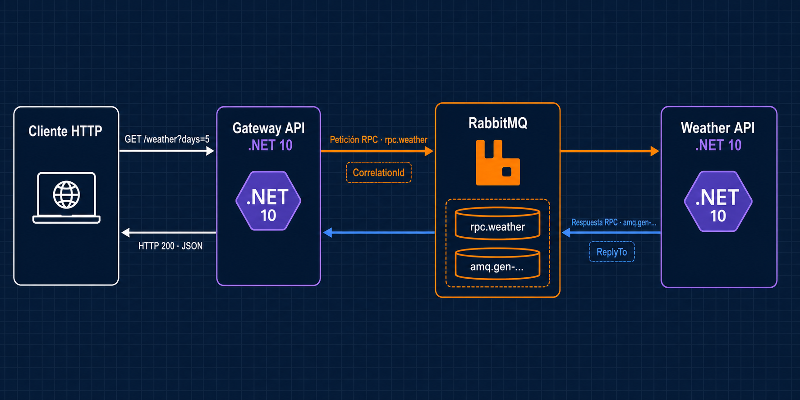

# RPC con RabbitMQ y .NET 10

Ejemplo de comunicación RPC mediante RabbitMQ. Un Gateway recibe una petición HTTP, publica una solicitud en la cola `rpc.weather` y espera la respuesta del servicio Weather.



## Proyectos

| Proyecto | Responsabilidad |
| --- | --- |
| `RabbitMqExample.Contracts` | Contratos compartidos. |
| `RabbitMqExample.Messaging` | Cliente RPC, mensajes, configuración y correlación. |
| `RabbitMqExample.Gateway.Api` | Recibe HTTP y realiza la llamada RPC. |
| `RabbitMqExample.Weather.Api` | Consume `rpc.weather` y publica la respuesta. |
| `RabbitMqExample.Tests` | Pruebas de la lógica meteorológica. |

## Ejecutar

Requisitos: .NET SDK 10, Visual Studio y Docker Desktop.

Inicia RabbitMQ desde la raíz de la solución:

```powershell
docker compose up -d
```

El panel RabbitMQ Management queda disponible en `http://localhost:15672`.

```text
Usuario:    app
Contraseña: app
```

Selecciona el perfil de solución `Gateway + Weather` y ejecuta la solución. Visual Studio inicia `RabbitMqExample.Gateway.Api` y `RabbitMqExample.Weather.Api`.

Cuando ambos servicios estén conectados a RabbitMQ, abre `src/RabbitMqExample.Gateway.Api/RabbitMqExample.Gateway.Api.http` y ejecuta `GET /weather?days=5`.

Resultado esperado:

- El Gateway publica una solicitud en `rpc.weather` con `CorrelationId` y `ReplyTo`.
- Weather genera los pronósticos y publica la respuesta en la cola indicada por `ReplyTo`.
- El Gateway relaciona la respuesta mediante `CorrelationId` y devuelve `200 OK`.

Los archivos `.http` también permiten consultar `/health` en ambos servicios.

## Comportamiento RPC

`rpc.weather` es una cola duradera para solicitudes. El Gateway crea una cola temporal `amq.gen-...` para recibir respuestas.

Weather utiliza ACK manual después de publicar la respuesta y `prefetchCount: 1`. El Gateway espera un máximo de 10 segundos antes de responder con `504 Gateway Timeout`.

| Código | Situación |
| --- | --- |
| `200` | Weather respondió correctamente. |
| `400` | `days` está fuera del rango 1 a 14. |
| `502` | Weather devolvió un error RPC. |
| `503` | El cliente RPC no está conectado a RabbitMQ. |
| `504` | La respuesta superó el tiempo de espera. |

## Detener RabbitMQ

```powershell
docker compose down
```

El volumen conserva los datos del broker.

El ejemplo básico está en [RabbitMQ-Ejemplo-Basico](https://github.com/sergioocode/RabbitMQ-Ejemplo-Basico).
